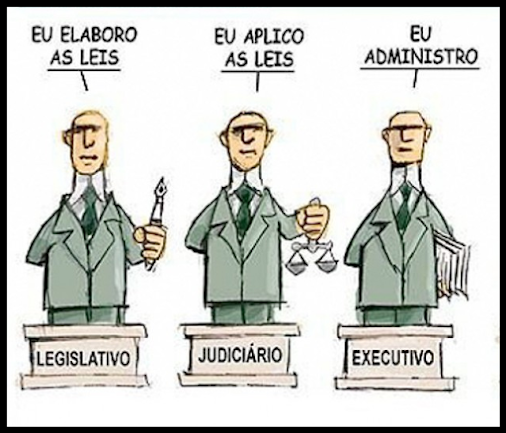

# E-Camara Organizada(E-CO)

  

>Para acompanhar novas propostas legislativas e tentar entender a conjuntura política atual, você foi chamado para modelar o E-Câmara Organizada (E-CO) um sistema que irá cadastrar deputados da Câmara de Deputados, comissões e propostas legislativas. Além desse cadastro, será necessário controlar o processo legislativo de uma proposta de lei, bem como simular votações e avaliar a opiniões da população perante os políticos cadastrados.

## Alunos

> *  Eric Diego Matozo Gonçalves - [@ericdmg](https://github.com/ericdmg)
> * Gabriel Mareco Batista de Souto - [@gabrielmbs](https://github.com/gabrielmbs/)
> * Victor Brandão de Andrade - [@victorbrandaoa](https://github.com/victorbrandaoa/)
> * Wellisson Gomes Pereira Bezerra Cacho - [@wellissongomes](https://github.com/wellissongomes)

  

